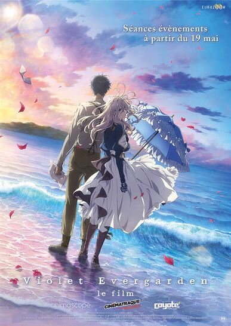

# app-dev 
### MY FIRST REPOSITORY
> #### Write some information about a *favorite series/movie* using different Markdown elements.
> 
> > *MY CHOSEN MOVIE*
> > - ***[Violet Evergarden: The Movie](#violet-evergarden-the-movie)***

ㅤ
 
# VIOLET EVERGARDEN: THE MOVIE

***Violet Evergarden: The Movie*** (劇場版ヴァイオレットエヴァーガーデン, *Gekijouban Vaioretto Evāgāden*) is a movie released for the _Violet Evergarden_ anime series, produced by Kyoto Animation. In the film, Violet Evergarden continues in her search for the meaning of the final words left by Gilbert Bougainvillea when she receives a request to write a letter from a boy named Yuris.

ㅤ

CONTENT&nbsp;&nbsp;(Click to Expand) 

 
### CONTENT 

 - &nbsp;&nbsp; [MOVIE INFO](#movie-info)
 - &nbsp;&nbsp; [MOVIE TRAILER](#movie-trailer)
 - &nbsp;&nbsp; [STAFF](#staff)
 - &nbsp;&nbsp; [CAST](#cast)
 - &nbsp;&nbsp; [TRIVIA](#trivia)
 

 
ㅤ
 
--------------
 

 
> ### MOVIE INFO
&nbsp;&nbsp;&nbsp;&nbsp;&nbsp;&nbsp; While writing other people’s emotions, she may have neglected her own. Violet Evergarden, the child soldier turned Auto Memory Doll, writes letters that evoke the words her clients can’t. But when a terminally ill boy requests her services for her family, her own feelings about love and loss resurface. Now she must confront her past and the death of the Major.

&nbsp;&nbsp;

&nbsp;&nbsp;&nbsp;&nbsp;&nbsp;&nbsp; **GENRE:** &nbsp;&nbsp;&nbsp; Fantasy, Anime

&nbsp;&nbsp;&nbsp;&nbsp;&nbsp;&nbsp; **ORIGINAL LANGUAGE:** &nbsp;&nbsp;&nbsp; Japanese

&nbsp;&nbsp;&nbsp;&nbsp;&nbsp;&nbsp; **RELEASE DATE (Theaters):** &nbsp;&nbsp;&nbsp; March 30, 2021  Limited

&nbsp;&nbsp;&nbsp;&nbsp;&nbsp;&nbsp; **RUNTIME:** &nbsp;&nbsp;&nbsp; 2 hours and 20 minutes

&nbsp;&nbsp;&nbsp;&nbsp;&nbsp;&nbsp; **WHERE TO WATCH:** &nbsp;&nbsp;&nbsp; Netflix

ㅤ
ㅤ
 
--------------

 
> ### MOVIE TRAILER

**The trailer is available on _Youtube._** [Watch it now.](https://www.youtube.com/watch?v=BUfSen2rYQs). 

ㅤ
 
 
 
ㅤ
 
--------------

 
> ### STAFF

 - &nbsp;&nbsp; **Director:** &nbsp;&nbsp;&nbsp;  Taichi Ishidate
 - &nbsp;&nbsp; **Script:** &nbsp;&nbsp;&nbsp; Reiko Yoshida
 - &nbsp;&nbsp; **Character Design/Chief Animation Director:** &nbsp;&nbsp;&nbsp;  Akiko Takase
 - &nbsp;&nbsp; **World Setting:** &nbsp;&nbsp;&nbsp; Takaaki Suzuki
 - &nbsp;&nbsp; **Art Director:** &nbsp;&nbsp;&nbsp; Mikiko Watanabe
 - &nbsp;&nbsp; **3D Art:** &nbsp;&nbsp;&nbsp; Joji Unoguchi
 - &nbsp;&nbsp; **Color Design:** &nbsp;&nbsp;&nbsp; Yuka Yoneda 
 - &nbsp;&nbsp; **Prop Design:** &nbsp;&nbsp;&nbsp; Hiroyuki Takahashi
 - &nbsp;&nbsp; **Director of Photography:** &nbsp;&nbsp;&nbsp; Kohei Funamoto
 - &nbsp;&nbsp; **3D Director:** &nbsp;&nbsp;&nbsp; Rin Yamamoto
 - &nbsp;&nbsp; **Sound Director:** &nbsp;&nbsp;&nbsp; Yota Tsuruoka
 - &nbsp;&nbsp; **Music:** &nbsp;&nbsp;&nbsp; Evan Call
ㅤ
 
 
 
ㅤ
 
--------------
 

 
> ### CAST

| &nbsp;&nbsp; MAIN &nbsp;&nbsp;&nbsp;&nbsp;&nbsp;&nbsp; | &nbsp;&nbsp; MINOR &nbsp;&nbsp;&nbsp;&nbsp;&nbsp;&nbsp; | 
| :----     |    :----   |   
| &nbsp;&nbsp; **Daisy Mongolia** &nbsp;&nbsp;&nbsp;&nbsp;&nbsp;&nbsp; | &nbsp;&nbsp; **Ann Mongolia** (flashbacks) &nbsp;&nbsp;&nbsp;&nbsp;&nbsp;&nbsp; | 
| &nbsp;&nbsp; Daisy's Parents &nbsp;&nbsp;&nbsp;&nbsp;&nbsp;&nbsp; | &nbsp;&nbsp; Irma Filech &nbsp;&nbsp;&nbsp;&nbsp;&nbsp;&nbsp; | 
| &nbsp;&nbsp; **Violet Evergarden** - Yui Ishikawa &nbsp;&nbsp;&nbsp;&nbsp;&nbsp;&nbsp; | &nbsp;&nbsp; **Queen Charlotte** (cameo) &nbsp;&nbsp;&nbsp;&nbsp;&nbsp;&nbsp; | 
| &nbsp;&nbsp; **Gilbert Bougainvillea** - Daisuke Namikawa &nbsp;&nbsp;&nbsp;&nbsp;&nbsp;&nbsp; | &nbsp;&nbsp; **King Damian** (cameo) &nbsp;&nbsp;&nbsp;&nbsp;&nbsp;&nbsp; | 
| &nbsp;&nbsp; Claudia Hodgins &nbsp;&nbsp;&nbsp;&nbsp;&nbsp;&nbsp; | &nbsp;&nbsp; **Oscar Webster** (flashback; cameo) &nbsp;&nbsp;&nbsp;&nbsp;&nbsp;&nbsp; | 
| &nbsp;&nbsp; Iris Cannary &nbsp;&nbsp;&nbsp;&nbsp;&nbsp;&nbsp; | &nbsp;&nbsp; **Mr. Bongainvilla** (flashback) &nbsp;&nbsp;&nbsp;&nbsp;&nbsp;&nbsp; | 
| &nbsp;&nbsp; Erica Brown &nbsp;&nbsp;&nbsp;&nbsp;&nbsp;&nbsp; | &nbsp;&nbsp; **Mrs. Bongainvilla** (mentioned) &nbsp;&nbsp;&nbsp;&nbsp;&nbsp;&nbsp; | 
| &nbsp;&nbsp; Cataleya &nbsp;&nbsp;&nbsp;&nbsp;&nbsp;&nbsp; | 
| &nbsp;&nbsp; Benedict Blue &nbsp;&nbsp;&nbsp;&nbsp;&nbsp;&nbsp; | 
| &nbsp;&nbsp; Yuris &nbsp;&nbsp;&nbsp;&nbsp;&nbsp;&nbsp; | 
| &nbsp;&nbsp; Dietfried Bonginvilla &nbsp;&nbsp;&nbsp;&nbsp;&nbsp;&nbsp; | 
| &nbsp;&nbsp; Gilbert Bongainvilla &nbsp;&nbsp;&nbsp;&nbsp;&nbsp;&nbsp; | 
| &nbsp;&nbsp; Roland &nbsp;&nbsp;&nbsp;&nbsp;&nbsp;&nbsp; | 
 
 
 
ㅤ
 
--------------
 

 
> ### TRIVIA

 - The movie was _originally scheduled to be released_ on **January 10, 2020**, but was _moved to_ **April 24, 2020.**
    - The date was _moved once again_ and is now slotted for a **September 18, 2020** release.
 - Moviegoers will randomly receive one of **three booklets** containing a short story written by Kana Akatsuki: _Benedict Blue's Violet, Oscar's Little Angel, and Violet Evergarden If_.
 - Starting October 2, moviegoers will receive a booklet with the short story Gilbert Bougainvillea and the Fleeting Dream.
 - Flashbacks from **"A Loved One Will Always Watch Over You"** are seen; 
    -  The letters seven-year-old Ann Mongolia recieved since the death of her mother, Daisy's maternal great-grandmother.
ㅤ
 
 
 
ㅤ
 
